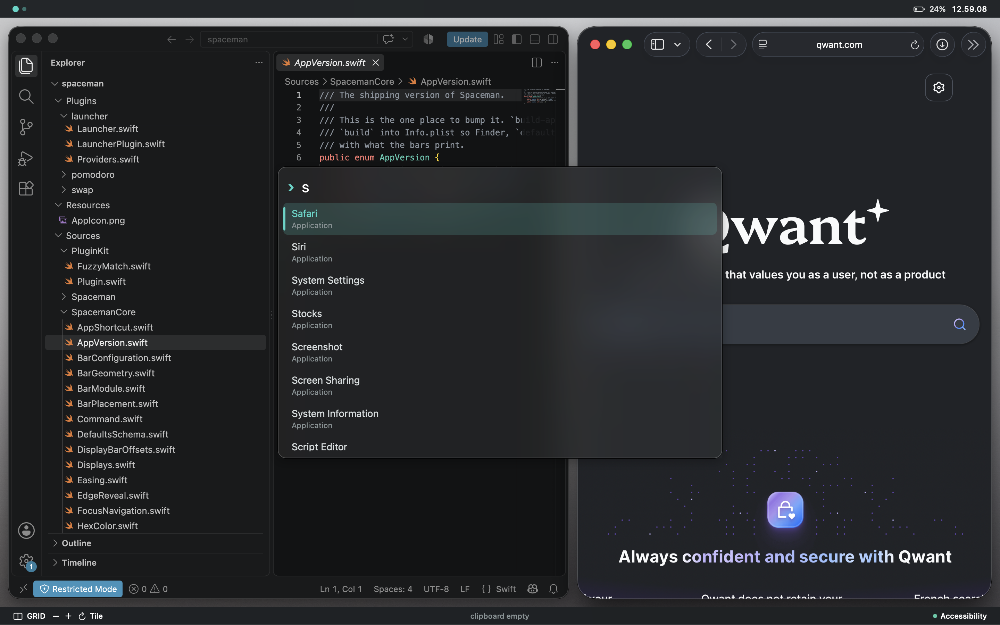
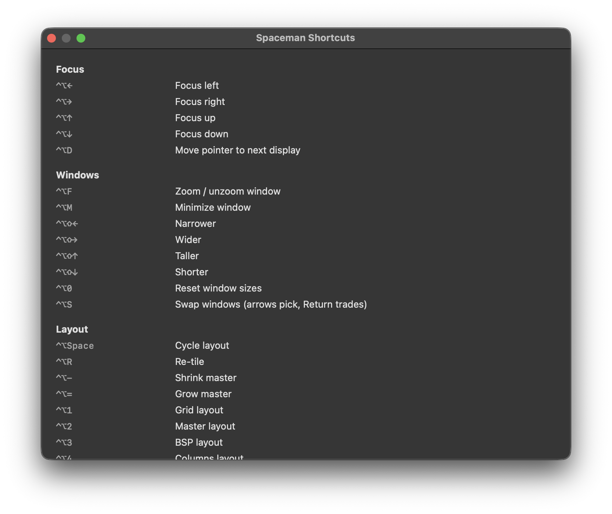

# Spaceman

[](https://www.apple.com/macos/)
[](https://www.swift.org/)
[](https://github.com/jordanjoewatson/spaceman/releases/latest)
[](https://github.com/jordanjoewatson/spaceman/releases)
[](LICENSE)

Spaceman is a configurable tiling window manager and status-bar environment for macOS. It adds keyboard-driven tiling, two-dimensional status bars, and an extensible plugin system while preserving familiar macOS workflows.

Spaceman complements Spaces, Mission Control, the Dock, and ordinary mouse-based window management rather than replacing them. It uses public macOS APIs, does not require System Integrity Protection to be disabled, and requests Accessibility permission only to manage windows.



## Features

- **Six tiling layouts:** grid, master stack, BSP, columns, rows, and monocle.
- **Two-dimensional status bars:** divide the top and bottom bars into horizontal zones, give each zone multiple pages, and click a zone to cycle its content.
- **Configurable appearance:** customize bar modules, shapes, colors, spacing, and per-display positioning.
- **Keyboard-driven control:** focus, resize, minimize, zoom, re-tile, and switch layouts using configurable global shortcuts.
- **Native settings:** configure tiling, bars, palettes, shortcuts, applications, and plugins through a macOS Settings window.
- **Plugin system:** includes a launcher, clipboard history, focus timer, and interactive window swapping.
- **Complements macOS:** continue using Spaces, Mission Control, the Dock, menu bar, mouse, and standard window controls alongside tiling.
- **Built for macOS:** supports notched displays, dark mode, system accent colors, Reduce Motion, and standard Accessibility APIs.

## Installation

Download `Spaceman.zip` from the [latest release](https://github.com/jordanjoewatson/spaceman/releases/latest), extract it, and move `Spaceman.app` to Applications.

On first launch, grant Spaceman access under **System Settings → Privacy & Security → Accessibility**. Tiling starts as soon as permission is granted.

## Shortcuts

The default shortcut leader is `⌃⌥`. Press `⌃⌥H` to see every command available in the current build. To change shortcuts, open **Settings…** from Spaceman's menu-bar item and select **Shortcuts**.



## Recommended macOS settings

For the best experience with Spaceman, use these macOS settings:

- Set **System Settings → Desktop & Dock → Position on screen** to **Bottom**.
- Enable **System Settings → Desktop & Dock → Automatically hide and show the Dock**.
- Disable **System Settings → Desktop & Dock → Automatically rearrange Spaces based on most recent use**.
- Enable **System Settings → Desktop & Dock → Displays have separate Spaces**.
- Enable **System Settings → Desktop & Dock → Drag windows to top of screen to enter Mission Control** so windows can be moved between Spaces manually.

## Build from source

Building requires macOS 14 or later and Xcode 16 or later. The command-line tools are sufficient.

```sh
git clone https://github.com/jordanjoewatson/spaceman.git
cd spaceman
./build-app.sh --run
swift test
```

`open Spaceman.app` does not restart an instance that is already running. Use `./build-app.sh --run`, or quit from the menu-bar item before reopening it.

An ad-hoc signature changes after each rebuild, so macOS may retain a stale Accessibility grant even when its checkbox appears enabled. Reset it with:

```sh
tccutil reset Accessibility com.spaceman.app
```

Signing and notarization instructions are in [docs/RELEASING.md](docs/RELEASING.md).

## Plugins

Plugins are selected at build time. The standard build includes the launcher, clipboard history, focus timer, and window swap plugins.

```sh
./build-app.sh --list
./build-app.sh --plugins launcher,clipboard
./build-app.sh --without pomodoro
./build-app.sh --core-only
```

## Project

- [Changelog](CHANGELOG.md)
- [Report a bug or request a feature](https://github.com/jordanjoewatson/spaceman/issues/new/choose)
- [Security policy](SECURITY.md)
- [MIT license](LICENSE)
